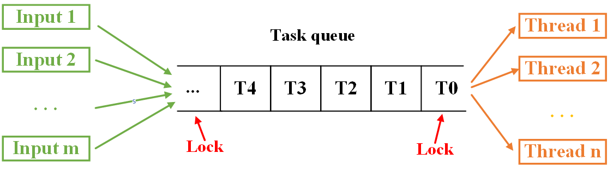
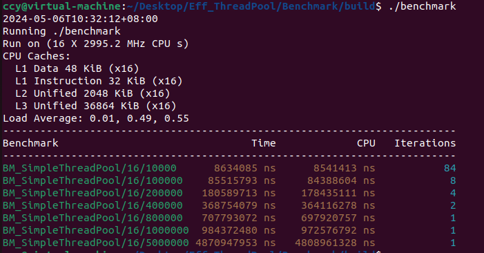
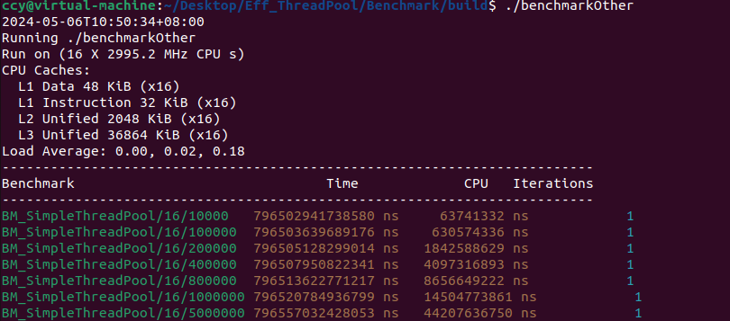

# Eff_ThreadPool

## 1. Purpose of the Thread Pool

1. Manages and schedules threads, saving the overhead caused by repeatedly creating and releasing threads.
2. Improves response speed as tasks can be executed immediately upon arrival without waiting for thread creation.

## 2. Design Philosophy
### Analysis
The common implementation of thread pools involves providing an interface to push tasks into a queue, which are then asynchronously executed by threads in the pool, followed by waiting (or not) for the result to return.
As shown in the diagram below, m input sources place tasks to be executed into a task queue, which are then consumed by n threads within the thread pool.

Assuming there are 5 threads available in the pool and 3 tasks in the queue, namely Task0, Task1, and Task2. These 5 threads compete for the right to execute Task0, and once one succeeds, the remaining 4 threads compete for Task1, and then the remaining 3 for Task2, and so on.

1. One can observe a **competition** for lock acquisition throughout the process, from adding tasks to the task queue and retrieving tasks from it. This `one by one` synchronization is relatively time-consuming and could be improved by increasing the fan-in and fan-out.
   
2. **Lock-free mechanism**: Internally encapsulates `mutex` and `condition_variable` to implement AtomicQueue, AtomicPriorityQueue, LockFreeRingBufferQueue.

3. **Local-thread mechanism**: Moves tasks from the pool's main task queue into private queues of the different threads (WorkStealingQueue type). This means threads no longer need to compete for tasks, effectively increasing the fan-out. Writing tasks into the thread's queue increases the fan-in.

4. **Work-stealing mechanism**: Suppose each thread has 100 tasks, with varying execution times. For instance, tasks in thread3 sleep for 1s, while those in thread1 and thread2 sleep for 1ms. Normally, a thread only executes tasks from its local queue. However, once thread1 and thread2 finish their tasks, they can "steal" tasks from thread3's queue (the 1s sleep tasks) to execute. This significantly reduces the total task completion time from 100s to around 30+s.

5. **Dynamic scaling mechanism**: During busy periods, more threads are added to the pool, and during idle times, threads are automatically reclaimed. The pool contains PrimaryThreads (PT) and SecondaryThreads (ST), with a fixed number of PTs operational at start-up and STs adjusted according to workload. **Determining busyness or idleness**: Uses a ‘running’ flag in combination with a ‘TTL (time to live)’ count. In addition to PTs and STs, a MonitorThread (MT) is deployed to periodically check the running status of PTs. If all are busy, an ST is added to help with task execution. Similarly, MT also checks the status of each ST, removing those inactive for consecutive TTL cycles.

6. **Task groups**: Suitable for assigning a unified wait time or callback function to a batch of tasks.

7. **Branch prediction optimization**: Optimized execution paths reducing loop overhead and achieving more efficient execution.

## 3. Benchmark
Testing was conducted on the following setup: 
Ubuntu VM: 16 cores, 8GB RAM

Both `EFF_ThreadPool` and a conventional `ThreadPool` were tested using 16 threads to schedule 10,000 to 5,000,000 empty tasks.

Below are the results for testing `EFF_ThreadPool`:

Below are the results for the conventional ThreadPool:

Using the largest task number (5,000,000) to calculate performance:

**EFF_ThreadPool**
Total time: 4.871 seconds
Number of tasks: 5,000,000
Tasks processed per second = Number of tasks / Total time = 5,000,000 / 4.871 ≈ 1,026,323.918 tasks/second

**Conventional ThreadPool**
Total time: 796557 seconds
Number of tasks: 5,000,000
Tasks processed per second = Number of tasks / Total time = 5,000,000 / 796557 ≈ 6.277 tasks/second

EFF_ThreadPool can achieve **millions of concurrent operations per second**, which is roughly **163491.889 times more efficient** than the conventional ThreadPool.
